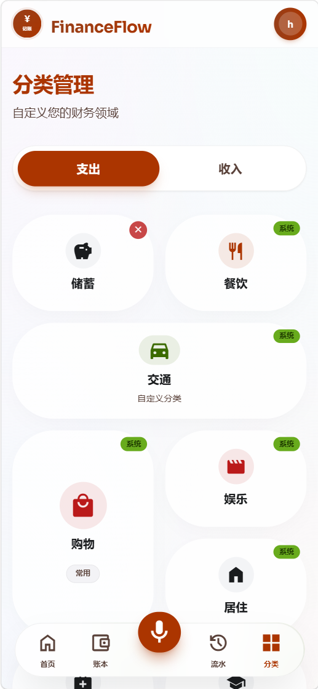
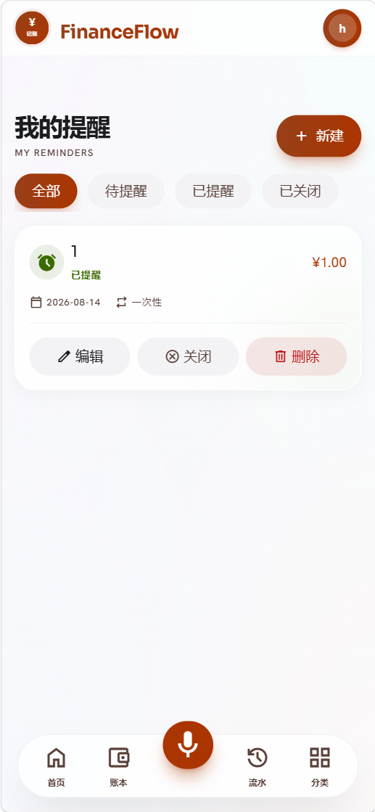

# Voice Accounting（语音记账）

基于语音交互的个人记账系统，支持多账本、收支分类、交易记录与提醒管理。

## 技术栈

| 层级 | 技术 |
|------|------|
| 后端 | Spring Boot 4.0.6 + Java 25 + MyBatis |
| 前端 | Vue 3.5 + Vite + Ant Design Vue 4.x + Pinia |
| 数据库 | MySQL 8.0 + Redis |
| 认证 | Sa-Token |
| 部署 | Docker Compose |

## 功能模块

- **用户体系** — 注册 / 登录，区分管理员与普通用户角色
- **账本管理** — 创建与管理多个独立账本
- **分类管理** — 自定义收支类别
- **记账功能** — 录入、查看、编辑交易记录
- **提醒功能** — 设置账单/还款等周期性提醒
- **管理后台** — 用户管理、全局分类/账本/交易/提醒管理

## 项目预览

| 首页仪表盘 | 账本管理 |
|------------|----------|
|  |  |

| 语音/手动记账 | 交易记录 |
|---------------|----------|
|  |  |

| 分类管理 | 提醒管理 |
|----------|----------|
|  |  |

## 项目结构

```
voice-accounting/
├── backend/          # Spring Boot 后端
│   └── src/main/java/com/hfh/api/
│       ├── admin/    # 管理员接口
│       ├── user/     # 用户接口
│       ├── entity/   # 实体类
│       ├── service/  # 业务逻辑
│       └── mapper/   # MyBatis Mapper
├── frontend/         # Vue 3 前端
│   └── src/
│       ├── api/      # API 请求封装
│       ├── views/    # 页面视图
│       ├── stores/   # Pinia 状态管理
│       └── router/   # 路由配置
├── docker-compose.yml
└── .env              # 环境变量配置
```

## 快速启动

> ⚠️ **安全提醒**：本仓库为公开仓库，**严禁提交任何密钥/密码**。
> 所有敏感配置（数据库密码、邮件授权码、DeepSeek/阿里云 API Key 等）一律通过
> 本地文件或环境变量注入，并以 `.example` 模板占位符形式入库。密钥文件（
> `.env`、`application-local.yaml`）已在 `.gitignore` 中，请勿强制添加。

### 1. 配置环境变量

#### 本地开发（后端）

```bash
# 在 backend 目录下
copy application-local.yaml.example application-local.yaml   # Windows
# cp application-local.yaml.example application-local.yaml  # Linux/macOS
```

编辑 `application-local.yaml`，填入你自己的密钥（DeepSeek / MySQL / Redis / 163邮箱授权码 / 阿里云 NLS）。

#### Docker 部署

```bash
# 在 docker-env 或 docker-conf 目录下
copy .env.example .env   # Windows
# cp .env.example .env  # Linux/macOS
```

编辑 `.env`，配置数据库连接信息、邮件授权码、DeepSeek 与阿里云密钥。

### 2. 启动基础服务

```bash
docker compose up -d mysql redis
```

### 3. 启动后端

```bash
cd backend
./mvnw spring-boot:run
```

### 4. 启动前端

```bash
cd frontend
npm install
npm run dev
```
## ☕ 捐赠支持

如果这个项目对你有帮助，请我喝杯奶茶吧～你的支持是我持续维护的动力！

<p align="center">
  
</p>

## License

内部项目，仅供学习交流使用。